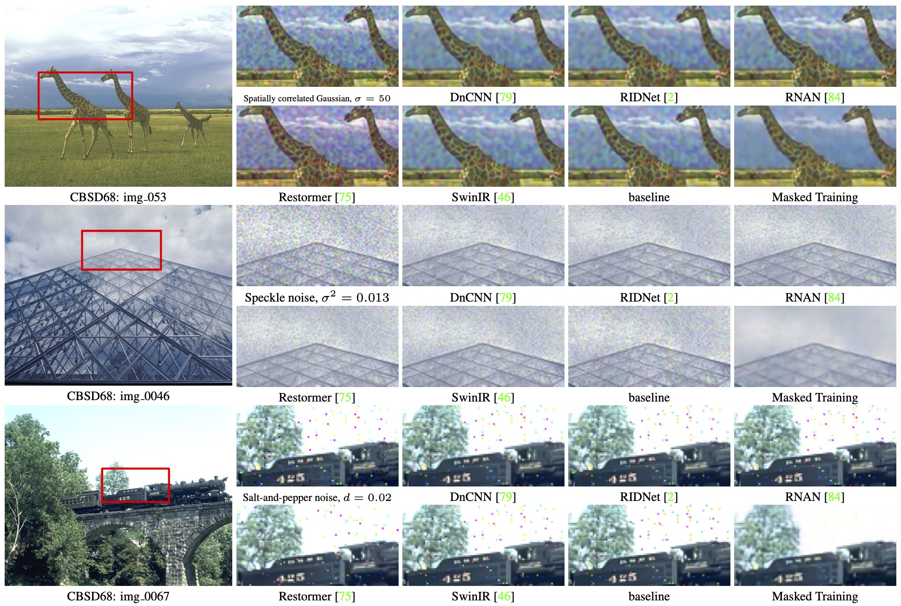
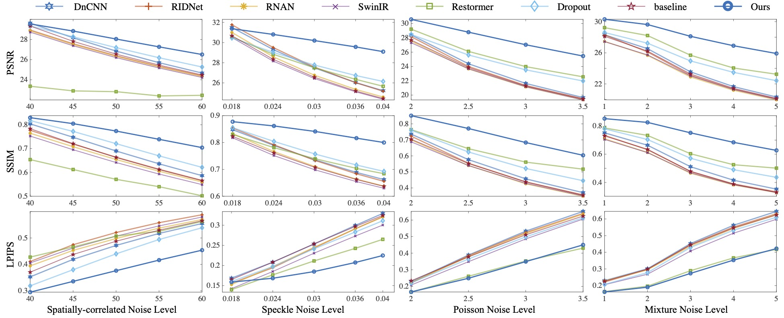
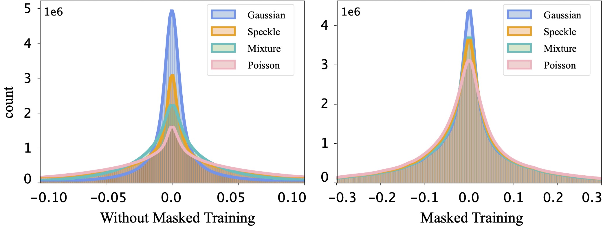

# Masked Image Training for Generalizable Deep Image Denoising

[Haoyu Chen](https://haoyuchen.com/), [Jinjin Gu](https://www.jasongt.com/), [Yihao Liu](https://scholar.google.com.hk/citations?user=WRIYcNwAAAAJ&hl=zh-CN&oi=ao), [Salma Abdel Magid](https://sites.google.com/view/salma-abdelmagid/), [Chao Dong](https://scholar.google.com.hk/citations?user=OSDCB0UAAAAJ&hl=zh-CN), Qiong Wang, [Hanspeter Pfister](https://scholar.google.com.hk/citations?hl=zh-CN&user=VWX-GMAAAAAJ), [Lei Zhu](https://sites.google.com/site/indexlzhu/home?authuser=0)

[[arXiv]](https://arxiv.org/abs/2303.13132)

***Code: coming soon.***

> Abstract: When capturing and storing images, devices inevitably introduce noise. Reducing this noise is a critical task called image denoising. Deep learning has become the de facto method for image denoising, especially with the emergence of Transformer-based models that have achieved notable state-of-the-art results on various image tasks. However, deep learning-based methods often suffer from a lack of generalization ability. For example, deep models trained on Gaussian noise may perform poorly when tested on other noise distributions. To address this issue, We present a novel approach to enhance the generalization performance of denoising networks, known as masked training. Our method involves masking random pixels of the input image and reconstructing the missing information during training. We also mask out the features in the self-attention layers to avoid the impact of training-testing inconsistency. Our approach exhibits better generalization ability than other deep learning models and is directly applicable to real- world scenarios. Additionally, our interpretability analysis demonstrates the superiority of our method.

## Masked Image Training

The transformer architecture of our proposed masked image training. We only make the minimal change to the original SwinIR architecture – the ***input mask*** operation and the ***attention masks***.

## Results

Visual comparison on ***out-of-distribution*** noise. All the networks are trained using Gaussian noise with standard deviation σ = 15. When all other methods fail completely, our method is still able to denoise effectively.

Performance comparisons on four noise types with different levels on the Kodak24 dataset. All models are trained only on Gaussian noise. Our masked training approach demonstrates good generalization performance across different noise types. We involve multiple types and levels of noise in testing, the results cannot be shown here. 

The distribution of baseline model features is biased across different noise types. Our method produces similar feature distributions across different noise.

## Citation
If you find it helpful, please consider citing:

    @InProceedings{Chen_2023_CVPR,
        author    = {Chen, Haoyu and Gu, Jinjin and Liu, Yihao and Magid, Salma Abdel and Dong, Chao and Wang, Qiong and Pfister, Hanspeter and Zhu, Lei},
        title     = {Masked Image Training for Generalizable Deep Image Denoising},
        booktitle = {Proceedings of the IEEE/CVF Conference on Computer Vision and Pattern Recognition (CVPR)},
        month     = {June},
        year      = {2023},
        pages     = {1692-1703}
    }

